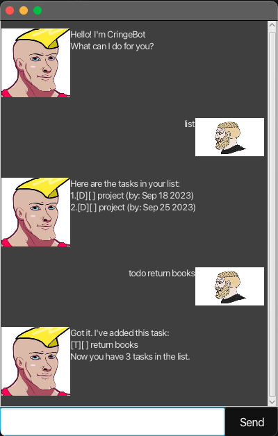

# CringeBot User Guide
CringeBot is a basic CLI-style task manager that helps you keep track of your tasks. 

## Quick Start
1. Ensure you have `Java 11` or above installed in your Computer.
2. Download the latest `cringebot.jar` from [here](https://github.com/Kurtyjlee/ip/releases).
3. Copy the file to the folder you want to use as the home folder for your CringeBot.
4. Open a command terminal, `cd` into the folder you put the jar file in, and use the `java -jar addressbook.jar` command to run the application.<br>
   A GUI similar to the below should appear in a few seconds. Note how the app contains some sample data.<br>
   
5. Type the command in the command box and press Enter to execute it. Some examples you can try:
     * `todo read book` : Adds a todo task named `read book` to the task list.
     * `list` : Lists all tasks.
     * `mark 1` : Marks the `1st task` as completed.
     * `bye`: Exits the app.
6. Refer to the Usage segment for more information on the commands.

## Features
CringeBot supports 3 types of tasks:
* Todo
* Deadline (Recurring)
* Event

With CringeBot, you can not only add and delete tasks, you also can:
* Mark tasks as completed
* Un-mark tasks as not yet completed
* List tasks
* Find tasks

## Usage

### Adding a Todo task: `todo`

Adds a todo task to the task list.

Format: `todo DESCRIPTION`

Examples:
- `todo read book`
- `todo do homework`

### Adding a Deadline task: `deadline`

Adds a deadline task to the task list. 

Format: `deadline DESCRIPTION /by DATE /recurring END_DATE`

Examples: 
* `deadline return book /by 2021-09-17`
* `deadline return book /by 2021-09-17 /recurring 2021-10-17`

**Note:** 
* The deadline task is not recurring by default, hence the `/recurring` flag is optional.
* Dates should be in the format `YYYY-MM-DD`.

### Adding a Event task: `event`
Adds a event task to the task list.

Format: `event DESCRIPTION /from DATE /to DATE`

Example:
* `event project meeting /from 2021-09-17 /to 2021-09-18`

### Listing all tasks: `list`

Shows a list of all tasks in the task list.

Format: `list`

Expected outcome:
```
Here are the tasks in your list:
1. [T][X] read book
2. [D][ ] return book (by: Sep 17 2021)
3. [E][ ] project meeting (from: Sep 17 2021 to: Sep 18 2021)
```

### Marking a task as completed: `mark`

Marks a task as completed.

Format: `mark INDEX`

Example:
* `mark 1`

Expected outcome:
```
Nice! I've marked this task as done:
[T][X] read book
```

### Un-marking a task as not yet completed: `unmark`

Un-marks a task as not yet completed.

Format: `unmark INDEX`

Example:
* `unmark 1`

### Deleting a task: `delete`

Deletes a task from the task list.

Format: `delete INDEX`

Example:

* `delete 1`

### Finding a task: `find`

Finds tasks whose descriptions contain the given keyword.

Format: `find KEYWORD`
* The search is case-sensitive. i.e. `book` will not match `Book`
* Only the description is searched.
* Substring will be matched. i.e. `book` will match `booklet`

Example:
* `find book`: potentially returns `read book` and `return booklet`

### Exiting the program: `bye`

Exits the program.

Format: `bye`

### Saving the data

CringeBot data are saved in the hard disk automatically after any command that changes the data. There is no need to save manually.

## Command Summary

Action | Format, Examples
--------|------------------
**Add Todo** | `todo DESCRIPTION` <br> e.g., `todo read book`
**Add Deadline** | `deadline DESCRIPTION /by DATE [/recurring END_DATE]` <br> e.g., `deadline return book /by 2021-09-17` <br> e.g., `deadline return book /by 2021-09-17 /recurring 2021-10-17`
**Add Event** | `event DESCRIPTION /from DATE /to DATE` <br> e.g., `event project meeting /from 2021-09-17 /to 2021-09-18`
**List** | `list`
**Mark** | `mark INDEX` <br> e.g., `mark 1`
**Unmark** | `unmark INDEX` <br> e.g., `unmark 1`
**Delete** | `delete INDEX` <br> e.g., `delete 1`
**Find** | `find KEYWORD` <br> e.g., `find book`
**Exit** | `bye`
